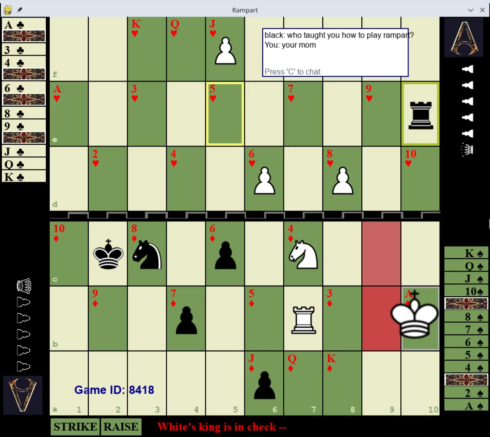
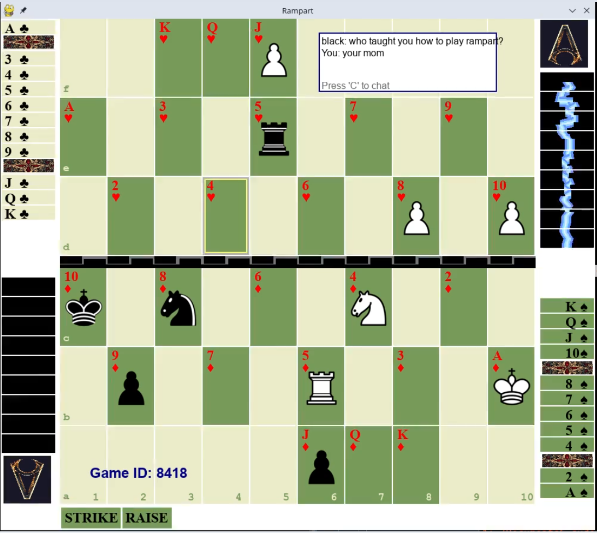
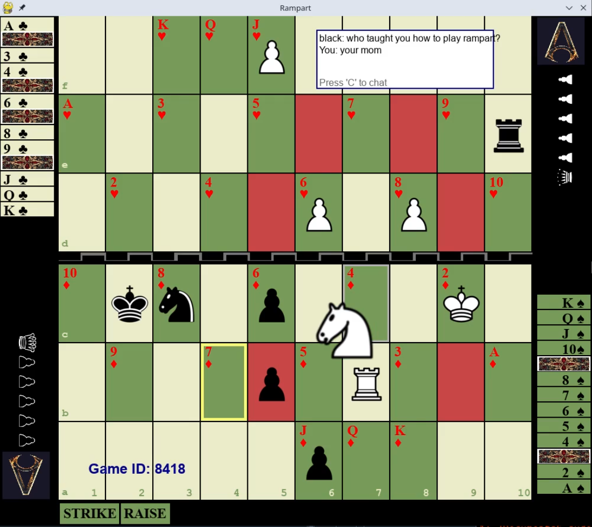
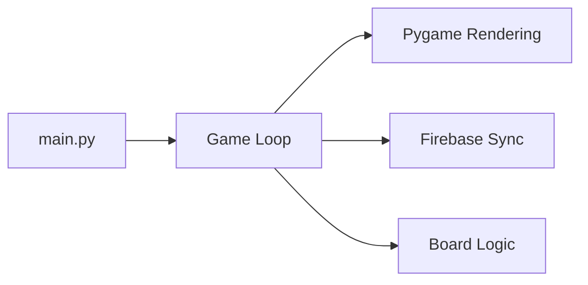

# Rampart ♟️

[](https://www.gnu.org/licenses/gpl-3.0) 
[](https://www.python.org/) 
[](https://www.pygame.org)

A strategic hybrid of chess and cardplay where players battle across a rampart barrier using tactical movement and card-based casting.

```text

██████╗░░█████╗░███╗░░░███╗██████╗░░█████╗░██████╗░████████╗
██╔══██╗██╔══██╗████╗░████║██╔══██╗██╔══██╗██╔══██╗╚══██╔══╝
██████╔╝███████║██╔████╔██║██████╔╝███████║██████╔╝░░░██║░░░
██╔══██╗██╔══██║██║╚██╔╝██║██╔═══╝░██╔══██║██╔══██╗░░░██║░░░
██║░░██║██║░░██║██║░╚═╝░██║██║░░░░░██║░░██║██║░░██║░░░██║░░░
╚═╝░░╚═╝╚═╝░░╚═╝╚═╝░░░░░╚═╝╚═╝░░░░░╚═╝░░╚═╝╚═╝░░╚═╝░░░╚═╝░░░
```

## Screenshots

| Gameplay | Casting Move | Multiplayer |
|----------|--------------|-------------|
|  |  |  |

## Features
| Category                 | Highlights                                                                 |
|--------------------------|----------------------------------------------------------------------------|
| **Hybrid Gameplay**      | Chess pieces + deck-building • Casting with card combinations              |
| **Realtime Multiplayer** | Firebase-powered battles • 4-digit PIN matchmaking                         |
| **Customization**        | Switchable themes (`T`) • Alternate piece styles (`Y`)                     |
| **Tactical Depth**       | Lightning animations • Graveyard resurrection mechanics                    |

## Official Rules
[](https://osf.io/a3cfz)  
Complete strategy guide including card combinations and special moves.

## Installation
```bash
git clone https://github.com/yourusername/rampart-chess.git
cd rampart-chess
pip install -r requirements.txt
```

## Quick Start
```bash
python3 share/rampart/main.py
```
- Press `H` to host or `J` to join
- No configuration needed - uses public demo server

## Controls
| Key       | Action                          | Mode           |
|-----------|---------------------------------|----------------|
| `H`       | Host game                       | Main menu      |
| `J`       | Join game                       | Main menu      | 
| `F`       | Flip board                      | In-game        |
| `T`/`Y`   | Switch theme/piece style        | Any time       |
| `R`       | Request rematch                 | Post-game      |
| `C`       | Open chat                       | Multiplayer    |

## Architecture


## Roadmap
- [x] Multiplayer core (v1.0)
- [x] Card casting system (v1.0)
- [ ] AI opponent (v1.1)
- [ ] Mobile touch support (v1.2)
- [ ] Tournament mode (v1.3)

## License
```text
Rampart - A strategic hybrid of chess and cardplay
Copyright (C) 2024 Jerod Michel

This program is free software: you can redistribute it and/or modify
it under the terms of the GNU General Public License as published by
the Free Software Foundation, either version 3 of the License, or
(at your option) any later version.

This program is distributed in the hope that it will be useful,
but WITHOUT ANY WARRANTY; without even the implied warranty of
MERCHANTABILITY or FITNESS FOR A PARTICULAR PURPOSE. See the
GNU General Public License for more details.

You should have received a copy of the GNU General Public License
along with this program. If not, see <https://www.gnu.org/licenses/>.
```

## Credits
Developed by **Jerod Michel** using:
-  Pygame
-  GPLv3
-  Python 3.8+

<!-- CacheBuster 1752523062 -->
<!-- LastUpdated: 2025-07-14 12:58:05 -->
