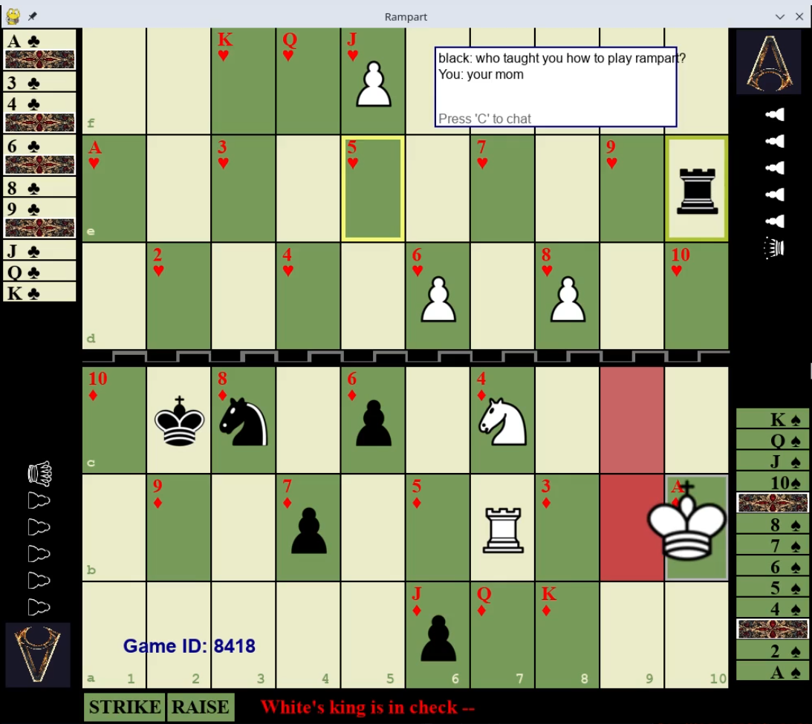
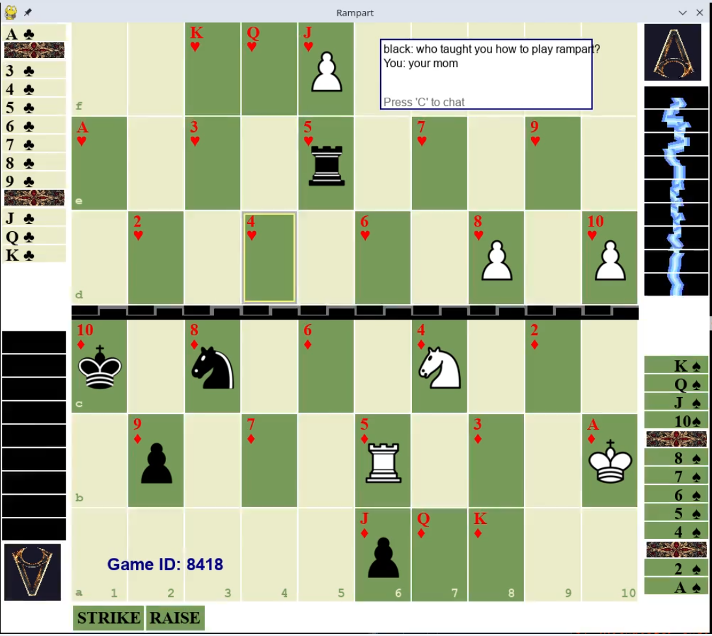
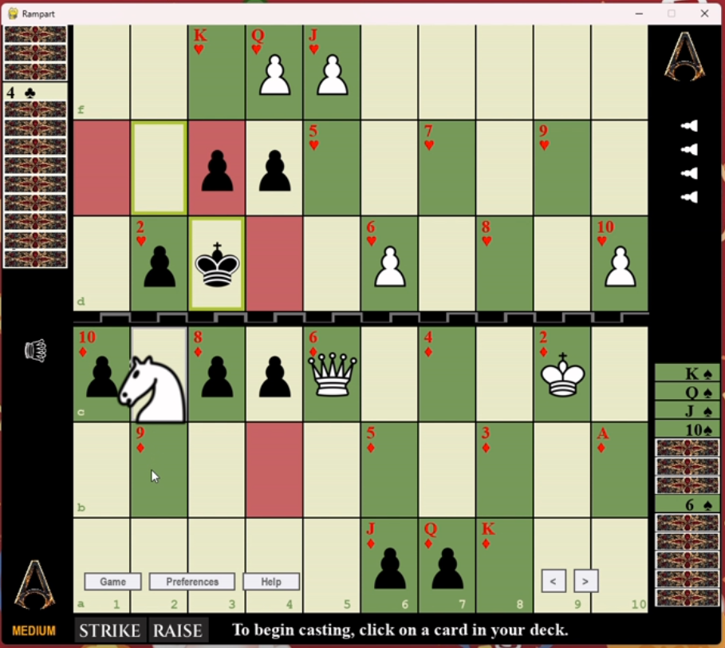
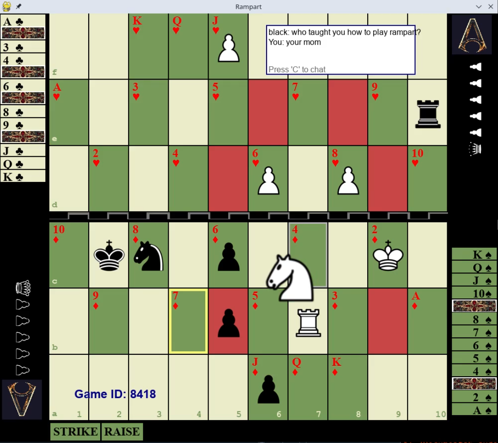
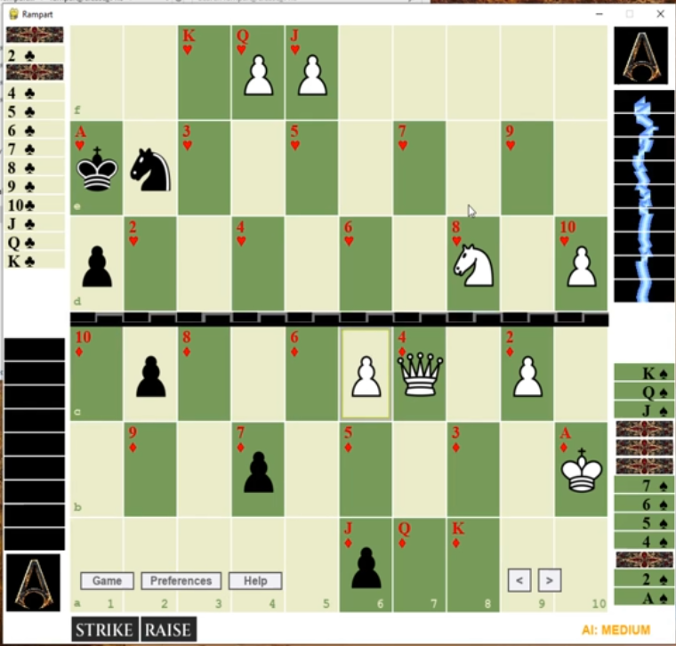
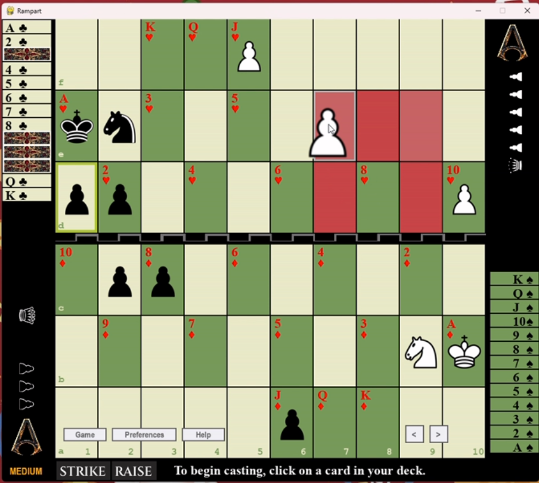

# Rampart ♟️

 
 

A strategic hybrid of chess and cardplay where players battle across a rampart barrier using tactical movement and card-based casting.

    ██████╗░░█████╗░███╗░░░███╗██████╗░░█████╗░██████╗░████████╗
    ██╔══██╗██╔══██╗████╗░████║██╔══██╗██╔══██╗██╔══██╗╚══██╔══╝
    ██████╔╝███████║██╔████╔██║██████╔╝███████║██████╔╝░░░██║░░░
    ██╔══██╗██╔══██║██║╚██╔╝██║██╔═══╝░██╔══██║██╔══██╗░░░██║░░░
    ██║░░██║██║░░██║██║░╚═╝░██║██║░░░░░██║░░██║██║░░██║░░░██║░░░
    ╚═╝░░╚═╝╚═╝░░╚═╝╚═╝░░░░░╚═╝╚═╝░░░░░╚═╝░░╚═╝╚═╝░░╚═╝░░░╚═╝░░░

  

## 🎮 Download & Play (Windows)
No installation required! To play immediately:
1. Go to the **[Releases](../../releases)** tab on the right side of this page.
2. Download the latest `Rampart_Windows_v1.0.zip`.
3. Extract the folder to your PC and double-click **`Rampart.exe`** (the launcher) to play!

## Video Demo

Watch full games of Rampart:

<table style="width:100%">
  <tr>
    <td align="center"><b>Full Gameplay (Client)</b></td>
    <td align="center"><b>Full Gameplay (AI)</b></td>
  </tr>
  <tr>
    <td align="center">
      
    </td>
    <td align="center">
      
    </td>
  </tr>
</table>

*Click the image above to watch the full gameplay video on YouTube*

## Screenshots

| Multiplayer | Cast Move | AI Mode |
|----------|--------------|-------------|
|  |  |  |
|  |  |  |

## Features
| Category                 | Highlights                                                                 |
|--------------------------|----------------------------------------------------------------------------|
| **Hybrid Gameplay** | Chess pieces + cardplay • Casting with card combinations                   |
| **Single Player AI** | Custom Negamax AI engine for local offline play                            |
| **Realtime Multiplayer** | Firebase-powered battles • 4-digit PIN to join game                        |
| **Customization** | Switchable themes (`T`) • Alternate piece styles (`Y`)                     |
| **Tactical Depth** | Lightning animations • Graveyard resurrection mechanics                    |

## Official Rules
  
Complete strategy guide including card combinations and special moves.

---

## Build from Source (For Developers)
If you want to view the code, run from the Python source, or contribute:

    # Clone using your actual GitHub username
    git clone https://github.com/jerodmichel/rampart.git
    cd rampart
    
    # Install Python dependencies
    pip install -r requirements.txt
    
    # Run the launcher
    python launcher.py

## Controls
| Key       | Action                          | Mode           |
|-----------|---------------------------------|----------------|
| `H` / `J` | Host / Join game                | Main menu      | 
| `F`       | Flip board perspective          | Global         |
| `T` / `Y` | Switch theme / piece style      | Global         |
| `S` / `L` | Save / Load Game                | Host Only      |
| `<-` / `->`| Step back/forward in history   | Global         |
| `R`       | Request rematch                 | Multiplayer    |
| `C`       | Open chat                       | Multiplayer    |

## Architecture
    mermaid
    flowchart LR
      A[launcher.py] --> B[Game Loop]
      B --> C[Pygame Rendering]
      B --> D[Firebase Sync]
      B --> E[Board Logic]
      B --> F[Negamax AI Engine]

## Roadmap
- [x] Multiplayer core (v1.0)
- [x] Card casting system (v1.0)
- [x] AI opponent (v1.1)
- [x] Native Linux Release (v1.1)
- [ ] Mobile touch support (v1.2)
- [ ] Tournament mode (v1.3)

## License
    Rampart - A strategic hybrid of chess and cardplay
    Copyright (C) 2024-2026 Jerod Michel
    
    This program is free software: you can redistribute it and/or modify
    it under the terms of the GNU General Public License as published by
    the Free Software Foundation, either version 3 of the License, or
    (at your option) any later version.

## Credits
Developed by **Jerod Michel** using:
-  Pygame
-  GPLv3
-  Python 3.8+

**Supporting developers:** Yucheng Gao, Mac McMorran

**Splash art/other art:** Leland Struebig/Billy Hill

**Additional Code Support:** Google Gemini (for helping me cross the finish line).
